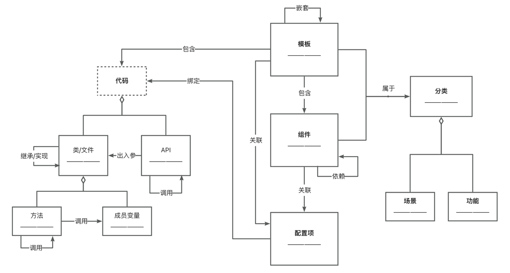

# 低代码知识图谱软件项目

面向低代码开发的知识图谱构建及检索服务

## 环境配置
JDK 11 \
Maven 3.9.9

## 项目目录结构
- controller: 前端请求处理，调用服务接口并返回
- dao: 数据访问层，提供 Neo4j 和 ES 的数据存取接口
- extraction: 知识挖掘及关联
- schema: 定义知识图谱的元模型，包括实体、关系、属性等。通过调用 dao 层接口实现数据持久化
- search: 组件及模板检索，基于 dao 层接口调用，向 controller 提供检索服务

## 知识图谱 Schema

