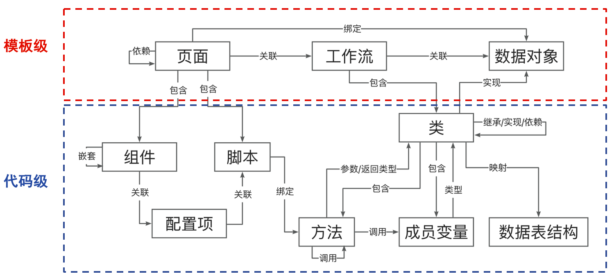
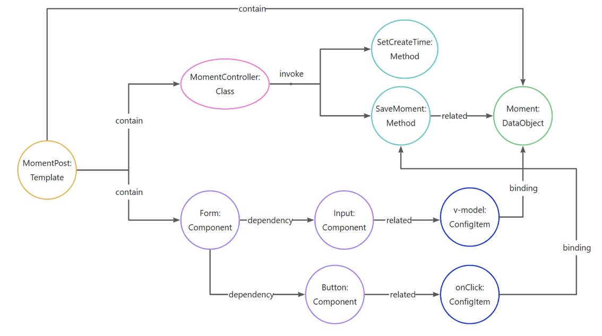

# 低代码知识图谱软件项目

面向低代码开发的知识图谱构建及检索服务

## 环境配置
JDK 17 \
Spring Boot 3.3.4 \
Maven 3.9.9

### Neo4j 配置
使用 docker 配置，neo4j 版本为 5.24

请提前准备一个文件夹 {your_path}，用来挂载容器内的目录
```
docker pull neo4j:5.24

docker run -d -p 7474:7474 -p 7687:7687 --name neo4j-5.24 -e "NEO4J_AUTH=neo4j/neo4j123456" -v {your_path}/data:/data -v {your_path}/logs:/logs -v {your_path}/conf:/var/lib/neo4j/conf -v {your_path}/import:/var/lib/neo4j/import neo4j:5.24
```

### ES 配置
使用 docker 配置 elasticsearch 的版本为8.15.0
```
docker pull docker.elastic.co/elasticsearch/elasticsearch:8.15.0

docker run -d --name elasticsearch \
  -e ELASTIC_USERNAME=elastic \
  -e ELASTIC_PASSWORD=changeme \
  -e discovery.type=single-node \
  -p 9200:9200 \
  -p 9300:9300 \
  docker.elastic.co/elasticsearch/elasticsearch:8.15.0
```
需要对于 elasticsearch 容器的 Files/usr/share/elasticsearch/config/elasticsearch.yml 作如下配置
```
cluster.name: "docker-cluster"
network.host: 0.0.0.0

#----------------------- BEGIN SECURITY AUTO CONFIGURATION -----------------------
#
# The following settings, TLS certificates, and keys have been automatically      
# generated to configure Elasticsearch security features on 13-11-2024 07:02:45
#
# --------------------------------------------------------------------------------

# Enable security features
xpack.security.enabled: true

xpack.security.enrollment.enabled: true

# Enable encryption for HTTP API client connections, such as Kibana, Logstash, and Agents
xpack.security.http.ssl:
  enabled: false
  keystore.path: certs/http.p12

# Enable encryption and mutual authentication between cluster nodes
xpack.security.transport.ssl:
  enabled: true
  verification_mode: certificate
  keystore.path: certs/transport.p12
  truststore.path: certs/transport.p12
http.host: 0.0.0.0
#----------------------- END SECURITY AUTO CONFIGURATION -------------------------
```

## 运行
- 编译打包：mvn package -Dmaven.test.skip=true（跳过测试，可选）
- 执行插件：java -jar target/LowCodeKG-0.0.1-SNAPSHOT.jar -gen {yml_config_path}
- 启动服务：java -jar target/LowCodeKG-0.0.1-SNAPSHOT.jar -exec

config.yml 示例
```yaml

# 依次执行以下插件(执行时数据位置需要替换为本地路径)

# 开源组件库 Ant Design 文档解析
org.example.lowcodekg.extraction.document.AntMDExtractor: 
  - /Users/chang/Documents/projects/ant-design/components
# Java 项目代码解析
org.example.lowcodekg.extraction.workflow.JavaExtractor:
  - /Users/chang/Documents/projects/data_projects/aurora/aurora-springboot
  - /Users/chang/Documents/projects/data_projects/NBlog/blog-api
```

## 知识图谱 Schema


### 查询子图示例


## 数据
- [蚂蚁开源组件库](https://github.com/ant-design/ant-design)
- 博客系统
  - https://github.com/linhaojun857/aurora
  - https://github.com/Naccl/NBlog
  - https://github.com/martin-chips/DimpleBlog
  - https://github.com/moxi624/mogu_blog_v2
- 电商系统
  - https://github.com/macrozheng/mall
  - https://github.com/macrozheng/mall-admin-web
  - https://github.com/macrozheng/mall-app-web
  - https://github.com/2227324689/gpmall
  - https://github.com/gz-yami/mall4j
  - https://github.com/newbee-ltd/newbee-mall
  - https://github.com/Exrick/xmall